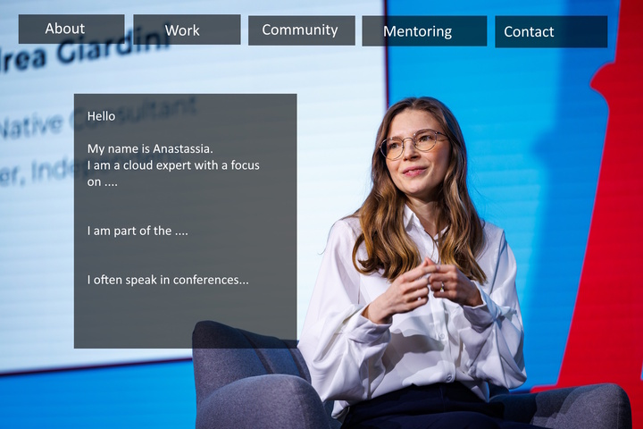

# Webpage for Anastasiia

I am not a web developer. I would appreciate your support and help me to complete the webpage. Any recommendations on the webpage design & styling are welcome.

The present issue:
1. A background picture cannot be resized automatically to fit the web browser's size.
2. No gray boxes for buttons to click on

ToDo:
1. Create  
    1.1. About page  
    1.2. Mentoring page  
    1.3. Contact page  
    1.4. Presentations Page  
2. Mobile Friendly page  

A rough webpage idea: 

